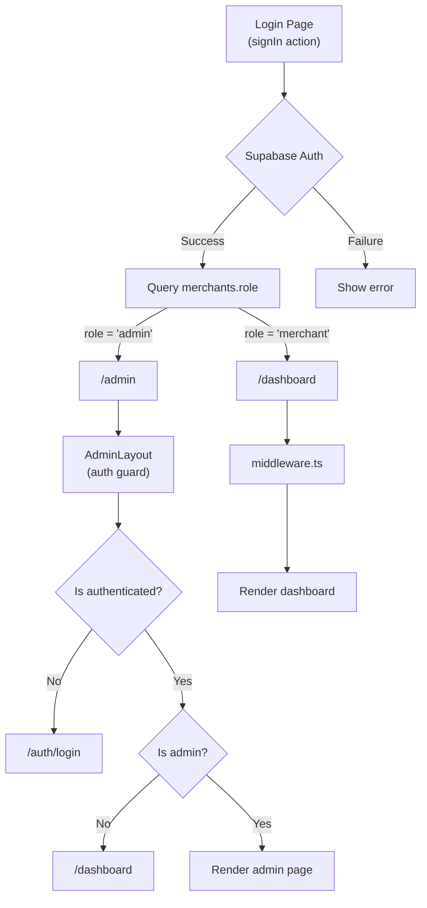
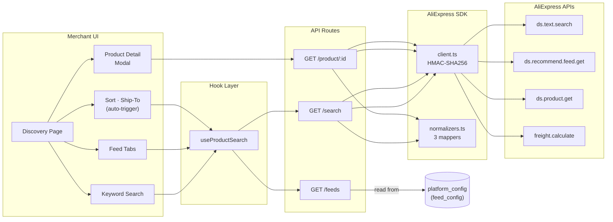
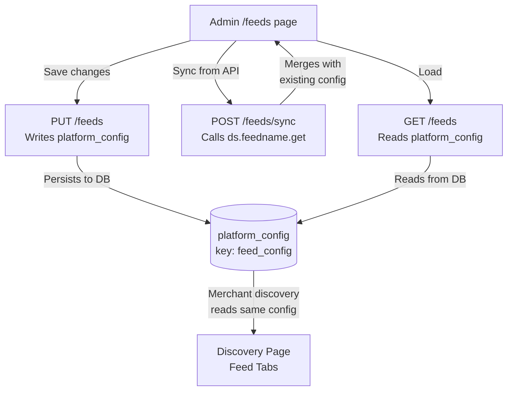
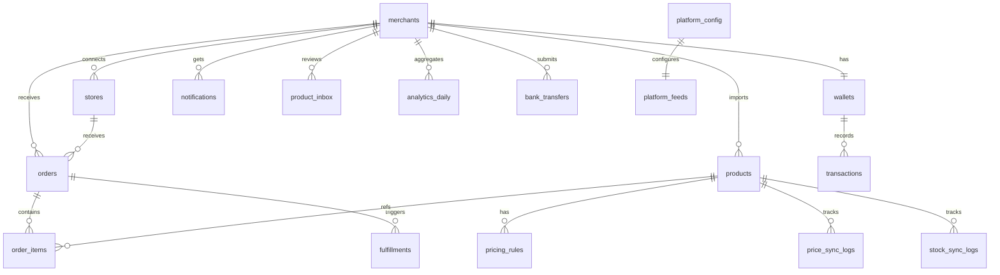

# DropLinker — Architecture Map

> Auto-generated from GitNexus Knowledge Graph
> **1416 nodes | 2,165 edges | 11 clusters | 69 execution flows**
> Last updated: 2026-05-16 (Session 9 — Product Shipping Editor + Token Auto-Refresh)

---

## System Overview

```mermaid
graph TB
    subgraph "Public Site"
        LP["LandingPage"]
        FP["FeaturesPage"]
        PP["PricingPage"]
    end

    subgraph "Auth Layer"
        Login["LoginPage"]
        Actions["auth/actions.ts\n(signUp, signIn, signOut)"]
        MW["middleware.ts\n(route protection)"]
        ServerClient["server.ts\n(createClient + createAdminClient)"]
    end

    subgraph "Dashboard Pages"
        DP["DashboardPage"]
        WP["WalletPage"]
        OP["OrdersPage"]
        MP["MyProductsPage"]
        SP["SettingsPage"]
        IP["IntegrationsPage"]
        DISC["DiscoverPage"]
    end

    subgraph "Admin Pages"
        ADP["AdminDashboardPage"]
        AMP["MerchantsPage"]
        AOP["AdminOrdersPage"]
        ATP["TransfersPage"]
        AFP["FeedsPage"]
        ASP["PlatformSettingsPage"]
        AdminLayout["AdminLayout\n(auth guard)"]
    end

    subgraph "Data Hooks Layer"
        HW["useWallet"]
        HO["useOrders"]
        HP["useProducts"]
        HM["useMerchant"]
        HI["useIntegrations"]
        HA["useAuth"]
        HAD["useAdmin\n(merchants, orders,\ntransfers, revenue, config)"]
        HPS["useProductSearch\n(keywords, feeds,\nfilters, pagination)"]
    end

    subgraph "Supabase"
        CC["createClient\n(browser)"]
        SC["createClient\n(server)"]
        AC["createAdminClient\n(service role)"]
    end

    subgraph "API Routes — Salla"
        SALLA_INIT["/api/auth/salla"]
        SALLA_CB["/api/auth/salla/callback"]
        DISC_API["/api/stores/[id]/disconnect"]
        WH["/api/webhooks/salla"]
        SALLA_CATS["/api/salla/categories"]
        SALLA_PRODS["/api/salla/products"]
    end

    subgraph "API Routes — Products"
        PROD_PUSH["/api/products/[id]/push"]
        PROD_CRUD["PATCH|DELETE /api/products/[id]"]
    end

    subgraph "API Routes — AliExpress"
        AE_SEARCH["/api/suppliers/aliexpress/search"]
        AE_DETAIL["/api/suppliers/aliexpress/product/[id]"]
        AE_FEEDS_GET["GET /feeds"]
        AE_FEEDS_PUT["PUT /feeds"]
        AE_FEEDS_SYNC["POST /feeds/sync"]
        AE_IMPORT["/api/suppliers/aliexpress/import"]
    end

    subgraph "AliExpress SDK"
        AE_CLIENT["aliexpress/client.ts\n(HMAC-SHA256 signing\n+ auto token refresh)"]
        AE_NORM["normalizers.ts\n(search, feed, detail)"]
    end

    subgraph "Salla SDK"
        SALLA_CLIENT["salla/client.ts\n(OAuth2 auto-refresh)"]
        SALLA_TYPES["salla/types.ts\n(payload typedefs)"]
    end

    subgraph "External"
        SALLA["Salla API"]
        AE_API["AliExpress API"]
        N8N["n8n Webhooks"]
        DB[("Supabase DB\n20 tables")]
    end

    %% Public → Auth
    LP -->|"Get Started"| Login
    FP -->|"Get Started"| Login
    PP -->|"Get Started"| Login

    %% Auth flow
    Login --> Actions
    Actions --> ServerClient
    Actions -->|"role check"| AdminLayout
    MW --> ServerClient

    %% Dashboard → Hooks
    DP --> HW
    DP --> HO
    WP --> HW
    OP --> HO
    MP --> HP
    SP --> HM
    IP --> HI
    DISC --> HPS

    %% Admin → Auth Guard → Hooks
    AdminLayout -->|"verify admin"| SC
    ADP --> HAD
    AMP --> HAD
    AOP --> HAD
    ATP --> HAD
    ASP --> HAD
    AFP -->|"load/save"| AE_FEEDS_GET
    AFP -->|"save config"| AE_FEEDS_PUT
    AFP -->|"sync API"| AE_FEEDS_SYNC

    %% Hooks → Supabase
    HW --> CC
    HO --> CC
    HP --> CC
    HM --> CC
    HI --> CC
    HA --> CC
    HAD --> CC

    %% Discovery Hook → API Routes
    HPS --> AE_SEARCH
    HPS --> AE_FEEDS_GET

    %% AliExpress API Routes → SDK → External
    AE_SEARCH --> AE_CLIENT
    AE_DETAIL --> AE_CLIENT
    AE_FEEDS_SYNC --> AE_CLIENT
    AE_CLIENT --> AE_API
    AE_SEARCH --> AE_NORM
    AE_DETAIL --> AE_NORM

    %% Feed persistence
    AE_FEEDS_GET --> SC
    AE_FEEDS_PUT --> SC
    AE_FEEDS_SYNC --> SC
    SC --> DB

    %% Salla API Routes → External
    SALLA_INIT --> SC
    SALLA_INIT --> SALLA
    SALLA_CB --> AC
    SALLA_CB --> SALLA
    DISC_API --> SC
    WH --> N8N

    %% Product CRUD → Salla SDK → External
    PROD_PUSH --> SALLA_CLIENT --> SALLA
    PROD_CRUD --> SALLA_CLIENT
    AE_IMPORT --> SALLA_CLIENT
    PROD_PUSH --> AC
    PROD_CRUD --> AC

    %% Supabase → DB
    CC --> DB
    AC --> DB
```



---

## Functional Areas (Clusters)

| Module | Symbols | Cohesion | Key Files |
|---|---|---|---|
| **Hooks** | 25 | 60% | `use-wallet.ts`, `use-orders.ts`, `use-products.ts`, `use-merchant.ts`, `use-integrations.ts`, `use-admin.ts`, `use-auth.ts` |
| **AliExpress** | 20+ | — | `lib/aliexpress/client.ts`, `normalizers.ts`, 5 API routes, `useProductSearch` |
| **Admin** | 15+ | — | `admin/layout.tsx` (auth guard), `admin/feeds/page.tsx`, admin hooks |
| **Settings** | 13 | 46% | `dashboard/settings/page.tsx` (ProfileTab, BillingTab, FulfillmentTab, NotificationsTab, TeamTab) |
| **App** | 12 | 47% | `layout.tsx`, `page.tsx`, shared components |
| **Dashboard** | 11 | 60% | `dashboard/page.tsx` (StatsRow, RecentOrders, AlertsPanel, RevenueChart) |
| **Auth** | 11 | 100% | `auth/actions.ts`, `login/page.tsx`, `middleware.ts` |
| **Discovery** | 10+ | — | `discover/page.tsx`, `SearchFilters`, `ProductGrid`, `ProductDetailModal` |
| **Pricing** | 9 | 43% | `pricing/page.tsx` |
| **Integrations** | 6 | 56% | `integrations/page.tsx`, `use-integrations.ts` |

---

## Auth & Security Architecture

### Role-Based Access



### Auth Boundaries

| Area | Protection | Method |
|---|---|---|
| `/dashboard/*` | Auth required | `middleware.ts` checks Supabase session |
| `/admin/*` | Admin role required | `AdminLayout` checks `merchants.role = 'admin'` |
| `PUT /api/suppliers/aliexpress/feeds` | Admin role required | Route handler checks merchant role |
| `POST /api/suppliers/aliexpress/feeds/sync` | Admin role required | Route handler checks merchant role |
| `/api/webhooks/salla` | HMAC signature | Token + SHA256 verification |
| Sign Out | Full session clear | `window.location.href` (not `router.push`) |

---

## AliExpress Integration Architecture



### Admin Feed Management Flow



### Normalizer Pipeline

| Source API | Normalizer | Output | Key Fields |
|---|---|---|---|
| `ds.text.search` | `normalizeSearchProduct()` | `NormalizedProduct` | itemId, targetSalePrice (SAR), orders, discount% |
| `ds.recommend.feed.get` | `normalizeFeedProduct()` | `NormalizedProduct` | product_id, product_title, sale_price (SAR) |
| `ds.product.get` | `normalizeProductDetail()` | `NormalizedProductDetail` | Nested DTOs: base_info, multimedia, sku_info |

**Currency:** All normalizers enforce SAR via `target_currency` parameter. No USD/CNY leaks.

---

## Critical Dependency: `createClient` (browser)

> **Risk: CRITICAL** — 40 dependents across 17 processes and 5 modules

This is the **single most impactful symbol** in the codebase. Changing its interface would break:

| Depth | What Breaks | Count |
|---|---|---|
| d=1 (WILL BREAK) | 14 hook fetch/update functions | `useWallet.fetch`, `useOrders.fetch`, `useProducts.fetch`, `useMerchant.fetch`, `useIntegrations.fetch`, `useAuth`, 8 admin functions |
| d=2 (LIKELY AFFECTED) | 12 hook exports | `useWallet`, `useOrders`, `useProducts`, `useMerchant`, `useIntegrations`, 5 admin hooks, `ProfileTab`, `TransfersPage` |
| d=3 (MAY NEED TESTING) | 14 page components | All dashboard + admin pages |

### Architecture Pattern

```
Page Component → Custom Hook → createClient → Supabase
```

Each hook already calls `createClient()` and has a `fetch` function. Pages don't need to change if the hook return shape stays the same.

---

## Key Execution Flows (Top 10)

| # | Flow | Steps | Type |
|---|---|---|---|
| 1 | SettingsPage → CreateClient | 5 | cross_community |
| 2 | DashboardPage → CreateClient | 5 | cross_community |
| 3 | IntegrationsPage → CreateClient | 5 | cross_community |
| 4 | AdminDashboardPage → CreateClient | 4 | cross_community |
| 5 | TransfersPage → CreateClient | 4 | cross_community |
| 6 | WalletPage → CreateClient | 4 | cross_community |
| 7 | OrdersPage → CreateClient | 4 | cross_community |
| 8 | MyProductsPage → CreateClient | 4 | cross_community |
| 9 | DiscoverPage → useProductSearch → API → AliExpress | 6 | cross_community |
| 10 | AdminFeedsPage → API → platform_config | 4 | cross_community |

---

## API Routes

| Route | Method | Purpose | Auth |
|---|---|---|---|
| `/api/auth/salla` | GET | Salla OAuth initiation | Server createClient |
| `/api/auth/salla/callback` | GET | Salla OAuth token exchange | Admin createClient |
| `/api/auth/aliexpress/callback` | GET | AliExpress OAuth token exchange | Admin createClient |
| `/api/stores/[id]/disconnect` | DELETE | Store deactivation | Server createClient |
| `/api/webhooks/salla` | POST | Salla webhook receiver | HMAC-SHA256 |
| `/api/suppliers/aliexpress/search` | GET | Keyword + feed product search | Server createClient |
| `/api/suppliers/aliexpress/product/[id]` | GET | Product detail + shipping | Server createClient |
| `/api/suppliers/aliexpress/feeds` | GET | Feed list from DB config | Server createClient |
| `/api/suppliers/aliexpress/feeds` | PUT | Admin saves feed config | Admin role check |
| `/api/suppliers/aliexpress/feeds/sync` | POST | Sync live feeds from AliExpress API | Admin role check |
| `/api/suppliers/aliexpress/import` | POST | Import product + auto-push to Salla | Server createClient |
| `/api/products/[id]` | PATCH | Inline edit (price, status, titles, shipping) | Admin createClient |
| `/api/products/[id]` | DELETE | Delete product + cleanup from Salla | Admin createClient |
| `/api/products/[id]/push` | POST | Manual push to Salla store | Admin createClient |
| `/api/products/[id]/shipping` | GET | Fetch live AliExpress shipping options | Server createClient |
| `/api/salla/categories` | GET | Fetch Salla store categories | Server createClient |
| `/api/salla/products` | GET | Sync native Salla products to DB | Admin createClient |

---

## Server Client Impact

> **Risk: MEDIUM** — 6 dependents across 1 process

| Depth | Symbol | File |
|---|---|---|
| d=1 | `signUp` | `auth/actions.ts` |
| d=1 | `signIn` | `auth/actions.ts` |
| d=1 | `GET` (Salla OAuth) | `api/auth/salla/route.ts` |
| d=1 | `POST` (Disconnect) | `api/stores/[id]/disconnect/route.ts` |
| d=1 | `GET/PUT` (Feeds) | `api/suppliers/aliexpress/feeds/route.ts` |
| d=1 | `POST` (Feed Sync) | `api/suppliers/aliexpress/feeds/sync/route.ts` |
| d=2 | `handleSubmit` (Login) | `auth/login/page.tsx` |

---

## Supabase Schema (20 Tables)



### Key Tables for Feed Management

| Table | Purpose |
|---|---|
| `platform_config` | Stores feed config (key: `feed_config`) as JSON — single source of truth for admin feed settings |
| `platform_feeds` | SQL migration for curated feeds (20 default feeds with enable/disable + bilingual names) |

### Key Functions

| Function | Purpose |
|---|---|
| `wallet_credit()` | Atomic deposit with transaction logging |
| `wallet_deduct()` | Atomic deduction with insufficient balance check |
| `calculate_retail_price()` | Margin calculator (percentage or fixed) |
| `is_admin()` | RLS helper — checks merchant role |
| `create_merchant_wallet()` | Trigger — auto-create wallet on signup |
| `update_timestamp()` | Trigger — auto-update `updated_at` |

---

## File Structure (Key Paths)

```
app/src/
├── app/
│   ├── page.tsx                          # Landing page
│   ├── features/page.tsx                 # Features page
│   ├── pricing/page.tsx                  # Pricing page
│   ├── auth/
│   │   ├── login/page.tsx                # Login form
│   │   └── actions.ts                    # signUp, signIn (role-based redirect)
│   ├── dashboard/
│   │   ├── layout.tsx                    # Dashboard shell + sign out
│   │   ├── page.tsx                      # Overview widgets
│   │   ├── products/discover/page.tsx    # AliExpress discovery UI
│   │   ├── products/page.tsx             # My Products (list + manage)
│   │   ├── products/[id]/page.tsx        # Product Editor (4 tabs: General, Images, Pricing, SEO)
│   │   ├── orders/page.tsx               # Order list
│   │   ├── wallet/page.tsx               # Balance + transactions
│   │   ├── settings/page.tsx             # Profile + fulfillment config
│   │   └── integrations/page.tsx         # Salla connect/disconnect
│   ├── admin/
│   │   ├── layout.tsx                    # Auth guard (admin role check)
│   │   ├── page.tsx                      # Admin dashboard
│   │   ├── feeds/page.tsx                # Feed management (sync, edit, save)
│   │   ├── merchants/page.tsx            # Merchant management
│   │   ├── orders/page.tsx               # Global order monitor
│   │   ├── transfers/page.tsx            # Bank transfer approvals
│   │   └── settings/page.tsx             # Platform settings
│   └── api/
│       ├── auth/salla/                   # Salla OAuth
│       ├── auth/aliexpress/callback/     # AliExpress OAuth callback
│       ├── stores/[id]/disconnect/       # Store disconnect
│       ├── webhooks/salla/               # Salla webhook handler
│       ├── products/[id]/
│       │   ├── route.ts                  # PATCH/DELETE product
│       │   ├── push/route.ts             # POST push to Salla
│       │   └── shipping/route.ts         # GET live AliExpress shipping options
│       └── suppliers/aliexpress/
│           ├── search/route.ts           # Product search API
│           ├── product/[id]/route.ts     # Product detail API
│           ├── feeds/route.ts            # GET feeds / PUT save config
│           ├── feeds/sync/route.ts       # POST sync from AliExpress
│           └── import/route.ts           # Import product + auto Salla push
├── components/shared/                    # Card, Button, Icon, ThemeToggle
├── hooks/                                # All data hooks
├── lib/
│   ├── supabase/
│   │   ├── client.ts                     # Browser createClient
│   │   └── server.ts                     # Server createClient + createAdminClient
│   ├── aliexpress/
│   │   ├── client.ts                     # HMAC-SHA256 API client + auto token refresh
│   │   └── normalizers.ts                # 3 product normalizers (SAR)
│   └── salla/
│       ├── client.ts                     # OAuth2 auto-refresh API client
│       └── types.ts                      # Salla payload type definitions
├── data/mockData.ts                      # Static marketing content ONLY
└── middleware.ts                          # Route protection
```
