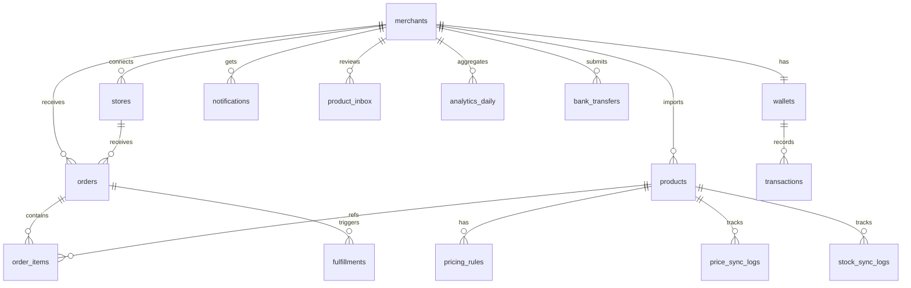

# DropLinker — Architecture Map

> Auto-generated from GitNexus Knowledge Graph
> **775 nodes | 1,243 edges | 11 clusters | 44 execution flows**
> Last indexed: 2026-05-15

---

## System Overview

```mermaid
graph TB
    subgraph "Public Site"
        LP["LandingPage"]
        FP["FeaturesPage"]
        PP["PricingPage"]
    end

    subgraph "Auth Layer"
        Login["LoginPage"]
        Register["RegisterPage"]
        Actions["auth/actions.ts\n(signUp, signIn, signOut)"]
        MW["middleware.ts\n(route protection)"]
        ServerClient["server.ts\n(createClient + createAdminClient)"]
    end

    subgraph "Dashboard Pages"
        DP["DashboardPage"]
        WP["WalletPage"]
        OP["OrdersPage"]
        MP["MyProductsPage"]
        SP["SettingsPage"]
        IP["IntegrationsPage"]
        DISC["DiscoverPage"]
    end

    subgraph "Admin Pages"
        ADP["AdminDashboardPage"]
        AMP["MerchantsPage"]
        AOP["AdminOrdersPage"]
        ATP["TransfersPage"]
        ASP["PlatformSettingsPage"]
    end

    subgraph "Data Hooks Layer"
        HW["useWallet"]
        HO["useOrders"]
        HP["useProducts"]
        HM["useMerchant"]
        HI["useIntegrations"]
        HA["useAuth"]
        HAD["useAdmin\n(merchants, orders,\ntransfers, revenue, config)"]
    end

    subgraph "Supabase"
        CC["createClient\n(browser)"]
        SC["createClient\n(server)"]
        AC["createAdminClient\n(service role)"]
    end

    subgraph "API Routes"
        SALLA_INIT["/api/auth/salla"]
        SALLA_CB["/api/auth/salla/callback"]
        DISC_API["/api/stores/[id]/disconnect"]
        WH["/api/webhooks/salla"]
    end

    subgraph "External"
        SALLA["Salla API"]
        N8N["n8n Webhooks"]
        DB[("Supabase DB\n19 tables")]
    end

    %% Public → Shared Components
    LP --> ThemeToggle
    LP --> Navbar
    
    %% Auth flow
    Login --> Actions
    Register --> Actions
    Actions --> ServerClient
    MW --> ServerClient

    %% Dashboard → Hooks
    DP --> HW
    DP --> HO
    WP --> HW
    OP --> HO
    MP --> HP
    SP --> HM
    IP --> HI

    %% Admin → Hooks
    ADP --> HAD
    AMP --> HAD
    AOP --> HAD
    ATP --> HAD
    ASP --> HAD

    %% Hooks → Supabase
    HW --> CC
    HO --> CC
    HP --> CC
    HM --> CC
    HI --> CC
    HA --> CC
    HAD --> CC

    %% API Routes → External
    SALLA_INIT --> SC
    SALLA_INIT --> SALLA
    SALLA_CB --> AC
    SALLA_CB --> SALLA
    DISC_API --> SC
    WH --> N8N

    %% Supabase → DB
    CC --> DB
    SC --> DB
    AC --> DB
```



---

## Functional Areas (Clusters)

| Module | Symbols | Cohesion | Key Files |
|---|---|---|---|
| **Hooks** | 25 | 60% | `use-wallet.ts`, `use-orders.ts`, `use-products.ts`, `use-merchant.ts`, `use-integrations.ts`, `use-admin.ts`, `use-auth.ts` |
| **Settings** | 13 | 46% | `dashboard/settings/page.tsx` (ProfileTab, BillingTab, FulfillmentTab, NotificationsTab, TeamTab) |
| **App** | 12 | 47% | `layout.tsx`, `page.tsx`, shared components |
| **Dashboard** | 11 | 60% | `dashboard/page.tsx` (StatsRow, RecentOrders, AlertsPanel, RevenueChart) |
| **Auth** | 11 | 100% | `auth/actions.ts`, `login/page.tsx`, `register/page.tsx`, `middleware.ts` |
| **Pricing** | 9 | 43% | `pricing/page.tsx` |
| **Integrations** | 6 | 56% | `integrations/page.tsx`, `use-integrations.ts` |

---

## Critical Dependency: `createClient` (browser)

> **Risk: CRITICAL** — 40 dependents across 17 processes and 5 modules

This is the **single most impactful symbol** in the codebase. Changing its interface would break:

| Depth | What Breaks | Count |
|---|---|---|
| d=1 (WILL BREAK) | 14 hook fetch/update functions | `useWallet.fetch`, `useOrders.fetch`, `useProducts.fetch`, `useMerchant.fetch`, `useIntegrations.fetch`, `useAuth`, 8 admin functions |
| d=2 (LIKELY AFFECTED) | 12 hook exports | `useWallet`, `useOrders`, `useProducts`, `useMerchant`, `useIntegrations`, 5 admin hooks, `ProfileTab`, `TransfersPage` |
| d=3 (MAY NEED TESTING) | 14 page components | All dashboard + admin pages |

### Key Insight for Phase 2

**The hooks layer is the correct place to wire real data.** The architecture already has a clean separation:

```
Page Component → Custom Hook → createClient → Supabase
```

Each hook already calls `createClient()` and has a `fetch` function. Phase 2 work is:
1. Replace the mock data return inside each hook's `fetch()` with real Supabase queries
2. The pages don't need to change at all if the hook return shape stays the same

---

## Key Execution Flows (Top 10)

| # | Flow | Steps | Type |
|---|---|---|---|
| 1 | SettingsPage → CreateClient | 5 | cross_community |
| 2 | DashboardPage → CreateClient | 5 | cross_community |
| 3 | IntegrationsPage → CreateClient | 5 | cross_community |
| 4 | AdminDashboardPage → CreateClient | 4 | cross_community |
| 5 | TransfersPage → CreateClient | 4 | cross_community |
| 6 | WalletPage → CreateClient | 4 | cross_community |
| 7 | OrdersPage → CreateClient | 4 | cross_community |
| 8 | MyProductsPage → CreateClient | 4 | cross_community |
| 9 | MerchantsPage → CreateClient | 4 | cross_community |
| 10 | FulfillmentTab → CreateClient | 4 | cross_community |

### Pattern: Every flow follows the same architecture

```
Page → [SubComponent] → useHook → fetch() → createClient() → Supabase
```

**This means Phase 2 is a hooks-only change** — pages stay untouched as long as we maintain the same return types from each hook.

---

## API Routes

| Route | Method | Purpose | Auth |
|---|---|---|---|
| `/api/auth/salla` | GET | Salla OAuth initiation | Server createClient |
| `/api/auth/salla/callback` | GET | Salla OAuth token exchange | Admin createClient |
| `/api/stores/[id]/disconnect` | POST | Store deactivation | Server createClient |
| `/api/webhooks/salla` | POST | Salla webhook proxy to n8n | None (forwarded) |

---

## Server Client Impact

> **Risk: MEDIUM** — 6 dependents across 1 process

| Depth | Symbol | File |
|---|---|---|
| d=1 | `signUp` | `auth/actions.ts` |
| d=1 | `signIn` | `auth/actions.ts` |
| d=1 | `signOut` | `auth/actions.ts` |
| d=1 | `GET` (Salla OAuth) | `api/auth/salla/route.ts` |
| d=1 | `POST` (Disconnect) | `api/stores/[id]/disconnect/route.ts` |
| d=2 | `handleSubmit` (Login) | `auth/login/page.tsx` |

---

## Supabase Schema (19 Tables)


