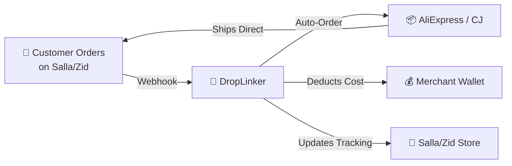
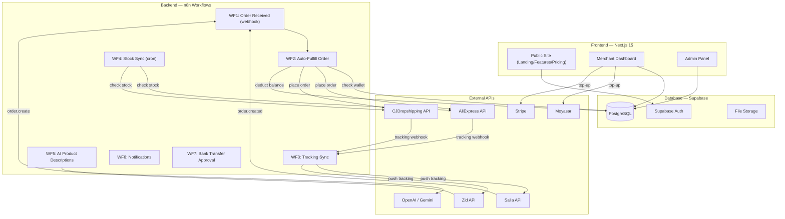
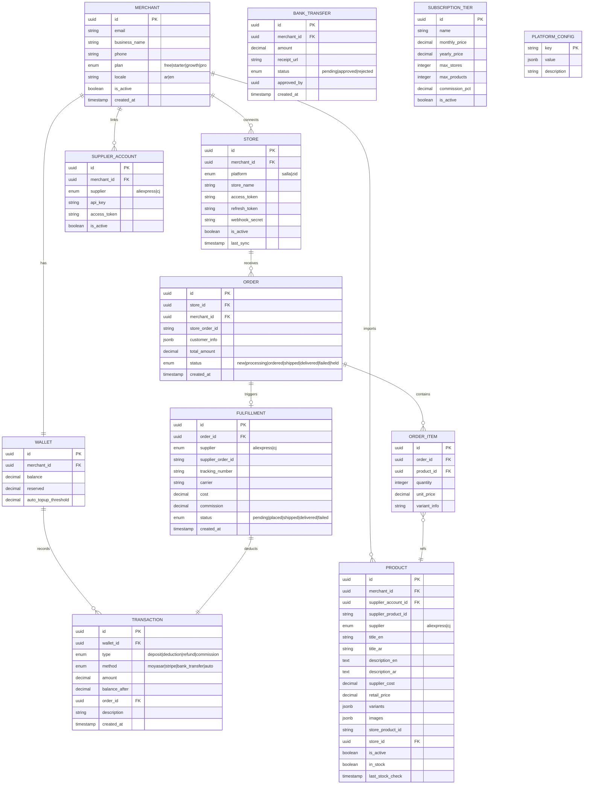
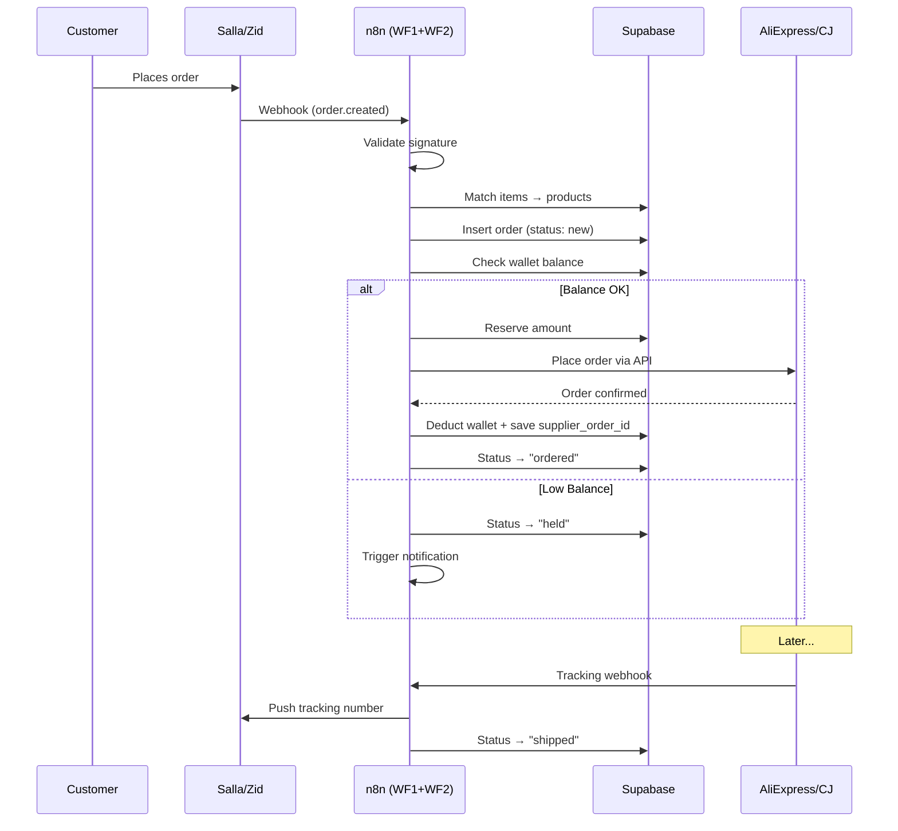

# DropLinker — Implementation Plan (v2)

> **Temporary Name:** DropLinker (until domain is finalized)

## 1. Business Concept

A SaaS platform connecting **Saudi e-commerce merchants** (Salla & Zid) with global suppliers (**AliExpress** & **CJDropshipping**). Automates the full dropshipping lifecycle: product import → order fulfillment → tracking sync.



**Revenue Model:** Admin-configurable — either commission per order (tier-based) OR subscription-only (no commission). Controlled from the admin panel.

---

## 2. Key Decisions (Confirmed)

| Decision | Answer |
|---|---|
| **Payment Gateways** | Moyasar + Stripe + Manual Bank Transfer |
| **Language** | Bilingual (Arabic + English) with switcher |
| **Target Market** | Saudi merchants initially, architecture ready for Gulf-wide expansion |
| **Supplier Priority** | AliExpress first (developer account exists), then CJDropshipping |
| **Commission** | Configurable from admin panel (commission % per tier OR subscription-only) |
| **Backend Logic** | n8n workflows (replaces BullMQ + Redis) |
| **AliExpress Status** | ✅ Developer account already exists |

---

## 3. Tech Stack

| Layer | Technology | Role |
|---|---|---|
| **Frontend** | Next.js 15 (App Router) | Marketing pages (SSR) + Dashboard (CSR) |
| **Styling** | Tailwind CSS v4 | RTL-friendly, rapid development |
| **Database** | Supabase (PostgreSQL) | Auth, RLS, real-time, storage |
| **Backend Workflows** | n8n (self-hosted) | Webhooks, API orchestration, AI, retries |
| **Payments** | Moyasar + Stripe | Wallet top-ups |
| **i18n** | next-intl | Arabic/English bilingual |
| **Language** | TypeScript | End-to-end type safety |
| **Hosting** | Vercel (frontend) + VPS (n8n) | Scalable |

---

## 4. Architecture



---

## 5. Website Pages — Complete List

### Part A: Public Marketing Site (4 pages)

#### 1. Landing Page (`/`)
Hero section selling the automation concept. "How it works" 3-step flow. Supplier & platform logos. Live stats. CTA to register. Bilingual toggle.

#### 2. Features (`/features`)
Detailed breakdown: Product Discovery, One-Click Import, Auto-Fulfillment, Wallet, Tracking Sync, Multi-Store. Each with icon + description + visual.

#### 3. Pricing (`/pricing`)
Subscription tiers with comparison table. Shows whether commission applies (depends on admin config). Toggle monthly/yearly. CTA to start free trial.

#### 4. Auth (`/login`, `/register`, `/forgot-password`)
Email/password registration. Collects: business name, email, phone, preferred platform (Salla/Zid). Google OAuth optional.

---

### Part B: Merchant Dashboard (9 pages)

#### 5. Dashboard Overview (`/dashboard`)
Command center with widgets:
- Wallet balance + quick top-up
- Orders: new / processing / shipped / delivered
- Products: total imported, active, out-of-stock
- Recent activity feed
- Revenue chart
- Alerts (low balance, failed orders)

#### 6. Product Discovery (`/dashboard/discover`)
Search engine for AliExpress & CJ products:
- Keyword search bar
- Filters: supplier, category, price, shipping country, rating
- Product cards: image, title, supplier cost, shipping time
- Detail modal: variants, full images, description
- "Import to Store" button → opens import wizard

#### 7. Import Wizard (`/dashboard/discover/import/:id`)
Multi-step product import:
1. Select variants (size/color)
2. Set retail price (profit margin calculator: `retail - cost - commission = profit`)
3. Edit title/description (AI rewrite button via n8n → GPT-4o)
4. Choose target store (Salla/Zid)
5. Confirm & publish → product goes live on store

#### 8. My Products (`/dashboard/products`)
Imported products management:
- Table/grid: image, title, retail price, cost, margin, stock, store
- Filters: by store, supplier, status
- Actions: edit price, re-sync stock, pause, delete
- Stock sync indicator (last synced time)

#### 9. Orders (`/dashboard/orders`)
Fulfillment operations center:
- Table: order #, customer, products, total, cost, profit, status, date
- Status pipeline: `New → Processing → Ordered → Shipped → Delivered`
- Detail view: customer info, supplier order link, wallet receipt, tracking
- Filters: status, store, supplier, date
- Bulk: retry failed, mark fulfilled

#### 10. Wallet (`/dashboard/wallet`)
Financial center:
- Balance card (large, prominent)
- **Top-up methods:**
  - Credit/Debit via Moyasar (Mada/Visa/MC)
  - Credit/Debit via Stripe
  - Manual bank transfer (upload receipt → admin approves via n8n workflow)
- Transaction history: type (deposit/deduction/refund/commission), amount, date, order ref, running balance
- Auto top-up toggle (charge card when balance < threshold)
- Low balance alert config

#### 11. Store Connections (`/dashboard/integrations/stores`)
- Connect Salla (OAuth 2.0 flow)
- Connect Zid (API key / OAuth)
- Connected stores list: name, platform, status, last sync
- Webhook health status
- Disconnect / re-sync buttons

#### 12. Supplier Accounts (`/dashboard/integrations/suppliers`)
- Connect AliExpress (OAuth via Open Platform — developer account ready)
- Connect CJDropshipping (API key)
- Connection health indicator
- Default supplier preference

#### 13. Settings (`/dashboard/settings`)
- **Profile:** business name, email, phone, password
- **Billing:** current plan, upgrade/downgrade, invoices
- **Auto-Fulfillment Rules:** enable/disable, min wallet balance, preferred shipping method, fallback supplier
- **Notifications:** email/SMS for orders, low balance, shipping
- **Team:** invite members with roles (Owner/Manager/Viewer)
- **Language:** switch AR/EN

---

### Part C: Admin Panel (6 pages)

> [!IMPORTANT]
> The admin panel is where the platform owner (you) manages merchants, controls monetization, and approves bank transfers.

#### 14. Admin Dashboard (`/admin`)
Platform-wide stats: total merchants, active orders, revenue, wallet deposits, failed orders.

#### 15. Merchant Management (`/admin/merchants`)
List all merchants. View/edit each merchant: profile, stores, products, orders, wallet. Suspend/activate accounts.

#### 16. Revenue & Commission Config (`/admin/revenue`)
**The monetization control center:**
- Toggle mode: commission-based vs subscription-only
- Set commission % per subscription tier
- Define subscription tiers (name, price, limits, features)
- View revenue breakdown (commissions collected, subscriptions, total)

#### 17. Bank Transfer Approvals (`/admin/transfers`)
Queue of pending bank transfer top-ups:
- Merchant name, amount, receipt image, date
- Approve / reject buttons (triggers n8n workflow → credits wallet)

#### 18. Order Monitor (`/admin/orders`)
Global view of all orders across all merchants. Filter by status, supplier, merchant. Investigate failed orders.

#### 19. Platform Settings (`/admin/settings`)
- Payment gateway config (Moyasar keys, Stripe keys)
- Supplier API keys (platform-level defaults)
- Email/SMS templates
- Platform name, logo, support email

---

## 6. n8n Workflows — Detailed

### WF1: Order Webhook Receiver
```
Trigger: Webhook (POST /webhook/salla-order, /webhook/zid-order)
Steps:
1. Validate webhook signature (Salla secret / Zid basic auth)
2. Parse order payload → extract: customer info, products, store ID
3. Match order items → find linked products in Supabase
4. Insert order record in Supabase (status: "new")
5. Trigger WF2 (Auto-Fulfill)
```

### WF2: Auto-Fulfill Order
```
Trigger: Called by WF1
Steps:
1. Check merchant's auto-fulfill setting (enabled?)
2. Query wallet balance from Supabase
3. Calculate total: supplier_cost + commission (if applicable)
4. IF balance >= total:
   a. Reserve amount (update wallet.reserved)
   b. Call AliExpress API → place order (or CJ API)
   c. IF success: deduct from wallet, save supplier_order_id, update status → "ordered"
   d. IF fail: release reservation, update status → "failed", trigger WF6
5. IF balance < total:
   a. Update status → "held"
   b. Trigger WF6 (low balance notification)
```

### WF3: Tracking Sync
```
Trigger: Webhook from AliExpress/CJ (tracking update) OR Cron (poll every 2h)
Steps:
1. Receive tracking number + carrier from supplier
2. Update fulfillment record in Supabase
3. Push tracking to Salla/Zid store via API
4. Update order status → "shipped"
5. Notify merchant (optional)
```

### WF4: Stock Sync (Scheduled)
```
Trigger: Cron (every 6 hours)
Steps:
1. Query all active products from Supabase
2. Batch check stock on AliExpress / CJ APIs
3. Update stock status in Supabase
4. If product went out-of-stock → mark inactive + notify merchant
5. Optionally update store listing via Salla/Zid API
```

### WF5: AI Product Description
```
Trigger: HTTP Request from Next.js (POST /n8n/ai-describe)
Steps:
1. Receive product title, images, category
2. Call GPT-4o / Gemini with prompt: "Write SEO product description in [AR/EN]"
3. Return generated title + description
4. (Optional) Also generate SEO keywords
```

### WF6: Notification Dispatcher
```
Trigger: Called by other workflows
Steps:
1. Receive: merchant_id, event_type, data
2. Query merchant notification preferences from Supabase
3. Send via configured channel:
   - Email (SMTP / SendGrid)
   - SMS (Twilio / local provider)
   - In-app notification (insert into Supabase notifications table)
```

### WF7: Bank Transfer Approval
```
Trigger: Called when admin approves transfer in admin panel
Steps:
1. Receive: transfer_id, approved_amount
2. Credit merchant wallet in Supabase
3. Insert transaction record (type: "deposit", method: "bank_transfer")
4. Update transfer status → "approved"
5. Notify merchant via WF6
```

---

## 7. Database Schema



### Key Tables Explained

| Table | Purpose |
|---|---|
| `MERCHANT` | User accounts with plan & locale |
| `WALLET` | Balance tracking per merchant |
| `TRANSACTION` | Every money movement (audit trail) |
| `STORE` | Connected Salla/Zid stores with tokens |
| `SUPPLIER_ACCOUNT` | Connected AliExpress/CJ accounts |
| `PRODUCT` | Imported products (bilingual titles) |
| `ORDER` / `ORDER_ITEM` | Customer orders from store webhooks |
| `FULFILLMENT` | Supplier order tracking per order |
| `BANK_TRANSFER` | Manual transfer approval queue |
| `SUBSCRIPTION_TIER` | Admin-managed pricing tiers |
| `PLATFORM_CONFIG` | Global settings (commission mode, keys, etc.) |

---

## 8. Auto-Fulfillment Flow (Core)



---

## 9. Bilingual (i18n) Strategy

| Content Type | Strategy |
|---|---|
| **UI labels** | `next-intl` with `ar.json` / `en.json` dictionaries |
| **Product content** | Dual columns in DB: `title_en`/`title_ar`, `description_en`/`description_ar` |
| **Layout direction** | `dir="rtl"` for Arabic, `dir="ltr"` for English (Tailwind RTL plugin) |
| **AI descriptions** | n8n WF5 generates in both languages |
| **Admin panel** | English-only (internal tool) |

---

## 10. Execution Roadmap

### Phase 1 — MVP (5-6 weeks)
> AliExpress + Salla + Core Dashboard

- [ ] Project setup: Next.js 15 + Tailwind + Supabase + next-intl
- [ ] Public site: Landing page, Features, Pricing, Auth
- [ ] Supabase: Schema, Auth, RLS policies
- [ ] Merchant dashboard: Overview, Settings
- [ ] AliExpress integration: Product search + detail via API
- [ ] Product Discovery page + Import Wizard
- [ ] My Products page (CRUD)
- [ ] Salla OAuth + webhook (order.created)
- [ ] Wallet system: balance display, manual bank transfer top-up
- [ ] n8n WF1 + WF2: Order webhook → auto-fulfill via AliExpress
- [ ] n8n WF3: Tracking sync (polling mode)
- [ ] Orders page with status pipeline
- [ ] Admin panel: Dashboard, Merchants, Bank Transfer Approvals
- [ ] Admin: Revenue config (commission vs subscription toggle)

### Phase 2 — Expand (3-4 weeks)
> CJDropshipping + Zid + Online Payments

- [ ] CJDropshipping integration (product search + auto-order)
- [ ] Zid OAuth + webhook integration
- [ ] Moyasar payment integration (wallet top-up)
- [ ] Stripe payment integration (wallet top-up)
- [ ] Auto top-up (charge card when balance < threshold)
- [ ] n8n WF4: Stock sync (cron every 6h)
- [ ] n8n WF5: AI product descriptions (GPT-4o)
- [ ] n8n WF6: Email/SMS notifications
- [ ] Multi-store support (connect multiple Salla/Zid stores)
- [ ] Admin: Order Monitor, Platform Settings

### Phase 3 — Scale (3-4 weeks)
> Polish + Advanced Features

- [ ] Supplier fallback logic (AliExpress out → try CJ)
- [ ] Advanced analytics dashboard (revenue charts, order trends)
- [ ] Team member access with roles
- [ ] Subscription billing automation (Stripe recurring)
- [ ] Mobile-responsive dashboard optimization
- [ ] Performance optimization + caching
- [ ] Gulf-wide expansion prep (multi-currency, additional gateways)

---

## 11. Verification Plan

### Automated
- Unit tests: wallet logic (deposit, deduct, insufficient balance, concurrent)
- Integration tests: webhook signature validation (Salla/Zid)
- E2E: mock webhook → n8n processes → order in DB → supplier API called → wallet deducted

### Manual
- Connect test Salla store → place order → verify auto-fulfill on AliExpress
- Bank transfer flow: upload receipt → admin approves → wallet credited
- Test held orders (low balance) → top up → retry → order placed
- Bilingual: switch AR↔EN, verify all UI + product content
- Admin panel: change commission mode → verify it applies to next order
