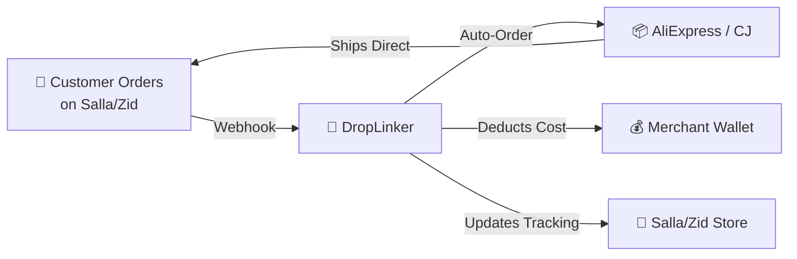
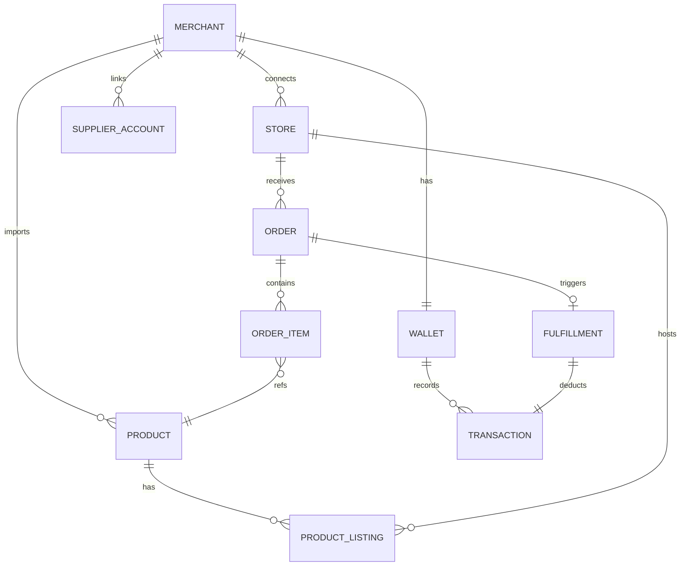
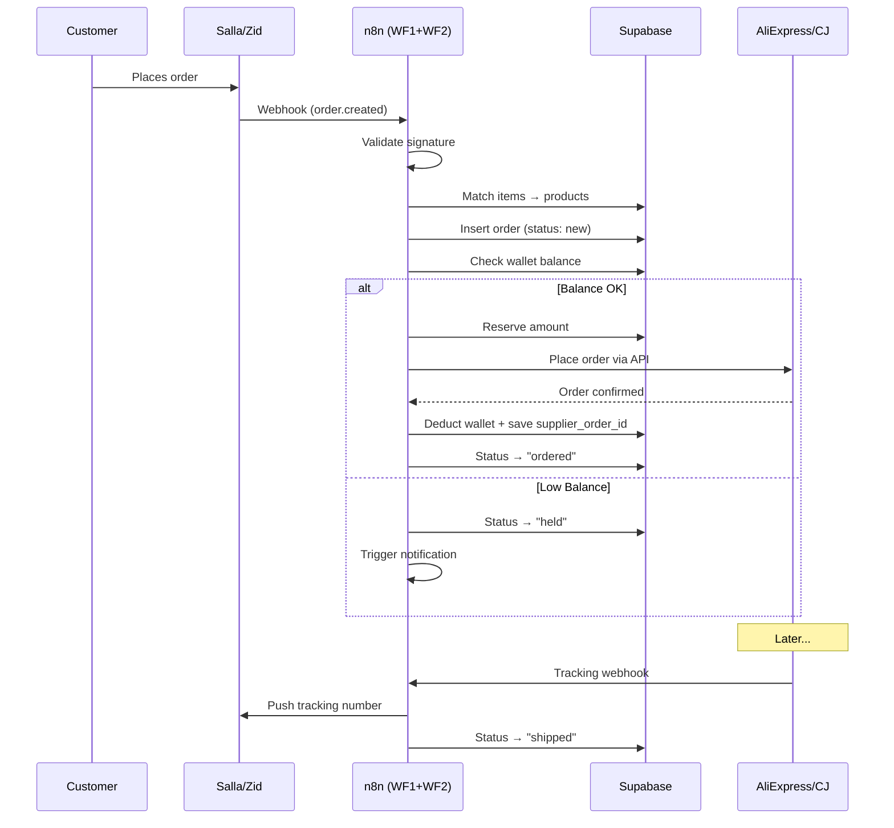

# DropLinker — Implementation Plan (v2)

> **Temporary Name:** DropLinker (until domain is finalized)
> **Last Updated:** 2026-05-20 (Session 17 — AI Content Engine + Admin Webhooks + Bugfixes)

## 1. Business Concept

A SaaS platform connecting **Saudi e-commerce merchants** (Salla & Zid) with global suppliers (**AliExpress** & **CJDropshipping**). Automates the full dropshipping lifecycle: product import → order fulfillment → tracking sync.



**Revenue Model:** Admin-configurable — either commission per order (tier-based) OR subscription-only (no commission). Controlled from the admin panel.

---

## 2. Key Decisions (Confirmed)

| Decision | Answer |
|---|---|
| **Payment Gateways** | Moyasar + Stripe + Manual Bank Transfer |
| **Language** | Bilingual (Arabic + English) with switcher |
| **Target Market** | Saudi merchants initially, architecture ready for Gulf-wide expansion |
| **Supplier Priority** | AliExpress first (developer account exists), then CJDropshipping |
| **Commission** | Configurable from admin panel (commission % per tier OR subscription-only) |
| **Backend Logic** | n8n workflows (replaces BullMQ + Redis) |
| **AliExpress Status** | ✅ Developer account already exists |

---

## 3. Tech Stack

| Layer | Technology | Role |
|---|---|---|
| **Frontend** | Next.js 16 (App Router) | Marketing pages (SSR) + Dashboard (CSR) |
| **Styling** | Tailwind CSS v4 | RTL-friendly, rapid development |
| **Database** | Supabase (PostgreSQL) | Auth, RLS, real-time, storage |
| **Backend Workflows** | n8n (self-hosted) | Webhooks, API orchestration, AI, retries |
| **Payments** | Moyasar + Stripe | Wallet top-ups |
| **i18n** | next-intl | Arabic/English bilingual |
| **Language** | TypeScript | End-to-end type safety |
| **Hosting** | Vercel (frontend) + VPS (n8n) | Scalable |

---

## 4. Architecture


---

## 5. Website Pages — Complete List

### Part A: Public Marketing Site (4 pages)

#### 1. Landing Page (`/`)
Hero section selling the automation concept. "How it works" 3-step flow. Supplier & platform logos. Live stats. CTA to register. Bilingual toggle.

#### 2. Features (`/features`)
Detailed breakdown: Product Discovery, One-Click Import, Auto-Fulfillment, Wallet, Tracking Sync, Multi-Store. Each with icon + description + visual.

#### 3. Pricing (`/pricing`)
Subscription tiers with comparison table. Shows whether commission applies (depends on admin config). Toggle monthly/yearly. CTA to start free trial.

#### 4. Auth (`/login`, `/register`, `/forgot-password`)
Email/password registration. Collects: business name, email, phone, preferred platform (Salla/Zid). Google OAuth optional.

---

### Part B: Merchant Dashboard (9 pages)

#### 5. Dashboard Overview (`/dashboard`)
Command center with widgets:
- Wallet balance + quick top-up
- Orders: new / processing / shipped / delivered
- Products: total imported, active, out-of-stock
- Recent activity feed
- Revenue chart
- Alerts (low balance, failed orders)

#### 6. Product Discovery (`/dashboard/discover`)
Search engine for AliExpress & CJ products:
- Keyword search bar
- Filters: supplier, category, price, shipping country, rating
- Product cards: image, title, supplier cost, shipping time
- Detail modal: variants, full images, description
- "Import to Store" button → opens import wizard

#### 7. Import Wizard (`/dashboard/discover/import/:id`)
Multi-step product import:
1. Select variants (size/color)
2. Set retail price (profit margin calculator: `retail - cost - commission = profit`)
3. Edit title/description (AI rewrite button via n8n → GPT-4o)
4. Choose target store (Salla/Zid)
5. Confirm & publish → product goes live on store

#### 8. My Products (`/dashboard/products`)
Imported products management:
- Table/grid: image, title, retail price, cost, margin, stock, store
- Filters: by store, supplier, status
- Actions: edit price, re-sync stock, pause, delete
- Stock sync indicator (last synced time)

#### 9. Orders (`/dashboard/orders`)
Fulfillment operations center:
- Table: order #, customer, products, total, cost, profit, status, date
- Status pipeline: `New → Processing → Ordered → Shipped → Delivered`
- Detail view: customer info, supplier order link, wallet receipt, tracking
- Filters: status, store, supplier, date
- Bulk: retry failed, mark fulfilled

#### 10. Wallet (`/dashboard/wallet`)
Financial center:
- Balance card (large, prominent)
- **Top-up methods:**
  - Credit/Debit via Moyasar (Mada/Visa/MC)
  - Credit/Debit via Stripe
  - Manual bank transfer (upload receipt → admin approves via n8n workflow)
- Transaction history: type (deposit/deduction/refund/commission), amount, date, order ref, running balance
- Auto top-up toggle (charge card when balance < threshold)
- Low balance alert config

#### 11. Store Connections (`/dashboard/integrations/stores`)
- Connect Salla (OAuth 2.0 flow)
- Connect Zid (API key / OAuth)
- Connected stores list: name, platform, status, last sync
- Webhook health status
- Disconnect / re-sync buttons

#### 12. Supplier Accounts (`/dashboard/integrations/suppliers`)
- Connect AliExpress (OAuth via Open Platform — developer account ready)
- Connect CJDropshipping (API key)
- Connection health indicator
- Default supplier preference

#### 13. Settings (`/dashboard/settings`)
- **Profile:** business name, email, phone, password
- **Billing:** current plan, upgrade/downgrade, invoices
- **Auto-Fulfillment Rules:** enable/disable, min wallet balance, preferred shipping method, fallback supplier
- **Notifications:** email/SMS for orders, low balance, shipping
- **Team:** invite members with roles (Owner/Manager/Viewer)
- **Language:** switch AR/EN

---

### Part C: Admin Panel (6 pages)

> [!IMPORTANT]
> The admin panel is where the platform owner (you) manages merchants, controls monetization, and approves bank transfers.

#### 14. Admin Dashboard (`/admin`)
Platform-wide stats: total merchants, active orders, revenue, wallet deposits, failed orders.

#### 15. Merchant Management (`/admin/merchants`)
List all merchants. View/edit each merchant: profile, stores, products, orders, wallet. Suspend/activate accounts.

#### 16. Revenue & Commission Config (`/admin/revenue`)
**The monetization control center:**
- Toggle mode: commission-based vs subscription-only
- Set commission % per subscription tier
- Define subscription tiers (name, price, limits, features)
- View revenue breakdown (commissions collected, subscriptions, total)

#### 17. Bank Transfer Approvals (`/admin/transfers`)
Queue of pending bank transfer top-ups:
- Merchant name, amount, receipt image, date
- Approve / reject buttons (triggers n8n workflow → credits wallet)

#### 18. Order Monitor (`/admin/orders`)
Global view of all orders across all merchants. Filter by status, supplier, merchant. Investigate failed orders.

#### 19. Platform Settings (`/admin/settings`)
- Payment gateway config (Moyasar keys, Stripe keys)
- Supplier API keys (platform-level defaults)
- Email/SMS templates
- Platform name, logo, support email

---

## 6. n8n Workflows — Detailed

### WF1: Order Webhook Receiver
```
Trigger: Webhook (POST /webhook/salla-order, /webhook/zid-order)
Steps:
1. Validate webhook signature (Salla secret / Zid basic auth)
2. Parse order payload → extract: customer info, products, store ID
3. Match order items → find linked products in Supabase
4. Insert order record in Supabase (status: "new")
5. Trigger WF2 (Auto-Fulfill)
```

### WF2: Auto-Fulfill Order
```
Trigger: Called by WF1
Steps:
1. Check merchant's auto-fulfill setting (enabled?)
2. Query wallet balance from Supabase
3. Calculate total: supplier_cost + commission (if applicable)
4. IF balance >= total:
   a. Reserve amount (update wallet.reserved)
   b. Call AliExpress API → place order (or CJ API)
   c. IF success: deduct from wallet, save supplier_order_id, update status → "ordered"
   d. IF fail: release reservation, update status → "failed", trigger WF6
5. IF balance < total:
   a. Update status → "held"
   b. Trigger WF6 (low balance notification)
```

### WF3: Tracking Sync
```
Trigger: Webhook from AliExpress/CJ (tracking update) OR Cron (poll every 2h)
Steps:
1. Receive tracking number + carrier from supplier
2. Update fulfillment record in Supabase
3. Push tracking to Salla/Zid store via API
4. Update order status → "shipped"
5. Notify merchant (optional)
```

### WF4: Stock Sync (Scheduled)
```
Trigger: Cron (every 6 hours)
Steps:
1. Query all active products from Supabase
2. Batch check stock on AliExpress / CJ APIs
3. Update stock status in Supabase
4. If product went out-of-stock → mark inactive + notify merchant
5. Optionally update store listing via Salla/Zid API
```

### WF5: AI Content Generation Engine (Session 16-17 — Infrastructure ✅, n8n Workflow 📋)
```
Trigger: HTTP Request from Next.js (POST to configurable webhook URL)
Steps:
1. Receive product title, images, category, supplier_type (aliexpress/cj)
2. Select supplier-aware prompt template (CJ vs AliExpress differences)
3. Call GPT-4o / Gemini / Claude with bilingual prompt:
   - Arabic: Saudi-market optimized, SAR pricing, local shipping context
   - English: SEO-optimized, professional product copy
4. Generate SEO metadata: meta_title, meta_description, url_slug
5. Return generated content + SEO data + quality score
6. (Optional) Generate social media posts (Instagram carousels, UGC)

Infrastructure Ready:
- Admin UI: AIContentEngineCard with webhook URL management + LLM key storage
- DB Schema: phase_content_automation.sql (7 tables) + phase_content_image_templates.sql
- Guide: n8n_content_workflows_guide.md with full workflow specs
- Product Editor: "Generate with AI" button ready to call webhook
Pending: Actual n8n workflow build + test
```

### WF6: Notification Dispatcher
```
Trigger: Called by other workflows
Steps:
1. Receive: merchant_id, event_type, data
2. Query merchant notification preferences from Supabase
3. Send via configured channel:
   - Email (SMTP / SendGrid)
   - SMS (Twilio / local provider)
   - In-app notification (insert into Supabase notifications table)
```

### WF7: Bank Transfer Approval
```
Trigger: Called when admin approves transfer in admin panel
Steps:
1. Receive: transfer_id, approved_amount
2. Credit merchant wallet in Supabase
3. Insert transaction record (type: "deposit", method: "bank_transfer")
4. Update transfer status → "approved"
5. Notify merchant via WF6
```

---

## 7. Database Schema

> ✅ **IMPLEMENTED** — 21+ tables deployed to Supabase (including `platform_feeds`, `product_listings`, and content automation tables). Products table extended with SEO + category columns. Content automation schema adds 7 new tables for AI content generation.



### Tables (21)

| # | Table | Purpose | Status |
|---|---|---|---|
| 1 | `merchants` | User accounts with plan, locale, fulfillment preferences | ✅ |
| 2 | `wallets` | Balance + reserved + auto-topup config | ✅ |
| 3 | `transactions` | Every money movement (audit trail) | ✅ |
| 4 | `stores` | Connected Salla/Zid stores with tokens + `salla_merchant_id` | ✅ |
| 5 | `supplier_accounts` | Connected AliExpress/CJ accounts | ✅ |
| 6 | `products` | Imported products (bilingual, pricing, stock) | ✅ |
| 7 | `orders` | Customer orders from webhooks | ✅ |
| 8 | `order_items` | Line items per order | ✅ |
| 9 | `fulfillments` | Supplier order tracking | ✅ |
| 10 | `bank_transfers` | Manual transfer approval queue | ✅ |
| 11 | `subscription_tiers` | Admin-managed pricing tiers | ✅ |
| 12 | `platform_config` | Global settings (commission mode, keys) | ✅ |
| 13 | `pricing_rules` | Per-product or merchant-wide margin rules | ✅ |
| 14 | `price_sync_logs` | Price change audit trail | ✅ |
| 15 | `stock_sync_logs` | Stock change audit trail | ✅ |
| 16 | `product_inbox` | AI quality gate for content review | ✅ |
| 17 | `analytics_daily` | Daily merchant metrics for P&L | ✅ |
| 18 | `trend_reports` | Weekly niche/category trend analysis | ✅ |
| 19 | `notifications` | In-app, email, SMS notification records | ✅ |
| 20 | `platform_feeds` | Curated AliExpress feeds with enable/disable + bilingual names | ✅ |
| 21 | `product_listings` | Maps products to stores (1:N) with store-specific pricing | ✅ |
| 22 | `content_generation_queue` | AI content generation job queue | ✅ |
| 23 | `content_generation_results` | Generated content versions with approval workflow | ✅ |
| 24 | `social_media_posts` | Scheduled social media posts | ✅ |
| 25 | `social_media_accounts` | Connected social media platform credentials | ✅ |
| 26 | `seo_metadata` | Generated SEO metadata per product | ✅ |
| 27 | `image_generation_templates` | Prompt presets for product image generation | ✅ |
| 28 | `content_schedules` | Recurring content automation schedules | ✅ |

### Key Functions

| Function | Purpose |
|---|---|
| `wallet_credit()` | Atomic deposit with transaction logging |
| `wallet_deduct()` | Atomic deduction with insufficient balance check |
| `calculate_retail_price()` | Margin calculator (percentage or fixed) |
| `is_admin()` | RLS helper — checks merchant role |
| `create_merchant_wallet()` | Trigger — auto-create wallet on signup |
| `update_timestamp()` | Trigger — auto-update `updated_at` |

---

## 8. Auto-Fulfillment Flow (Core)



---

## 9. Salla Webhook Payload Reference

> Verified against `Merchant APIs V2.7.6.postman_collection.json`

### Order Created (`order.created`) — Key Fields

```json
{
  "event": "order.created",
  "merchant": 964562487,
  "data": {
    "id": 418149270,
    "reference_id": 3879219,
    "status": {
      "id": 1298199463,
      "name": "بإنتظار المراجعة",
      "slug": "under_review"
    },
    "payment_method": "mada",
    "currency": "SAR",
    "amounts": {
      "sub_total": { "amount": 250, "currency": "SAR" },
      "shipping_cost": { "amount": 13.04, "currency": "SAR" },
      "tax": { "percent": "15.00", "amount": { "amount": 39.46, "currency": "SAR" } },
      "total": { "amount": 302.5, "currency": "SAR" }
    },
    "customer": {
      "id": 1473353380,
      "first_name": "أحمد",
      "last_name": "Conn",
      "mobile": 501724227,
      "mobile_code": "+966",
      "email": "demo@demo.com"
    },
    "items": [
      {
        "id": 951850235,
        "name": "فحم سداسي",
        "sku": "6285579005111",
        "quantity": 1,
        "amounts": {
          "total": { "amount": 45.22, "currency": "SAR" }
        },
        "product": { "id": 268564496, "type": "product" }
      }
    ]
  }
}
```

### Salla Order Status Slugs

| Slug | Meaning |
|---|---|
| `under_review` | New, pending review |
| `in_progress` | Being processed |
| `completed` | Fulfilled/completed |
| `canceled` | Cancelled by merchant/customer |
| `payment_pending` | Awaiting payment |
| `delivering` | In transit |
| `delivered` | Delivered to customer |
| `restoring` | Return in progress |
| `restored` | Returned |

---

## 10. Bilingual (i18n) Strategy

| Content Type | Strategy |
|---|---|
| **UI labels** | `next-intl` with `ar.json` / `en.json` dictionaries |
| **Product content** | Dual columns in DB: `title_en`/`title_ar`, `description_en`/`description_ar` |
| **Layout direction** | `dir="rtl"` for Arabic, `dir="ltr"` for English (Tailwind RTL plugin) |
| **AI descriptions** | n8n WF5 generates in both languages |
| **Admin panel** | English-only (internal tool) |

---

## 11. Execution Roadmap

### Phase 1 — Foundation ✅ DONE
> Project setup, database, auth, Salla OAuth

- [x] Project setup: Next.js 16 + Tailwind + Supabase
- [x] Public site: Landing page, Features, Pricing, Auth UI
- [x] Supabase: Full schema (19 tables), RLS policies, triggers, functions
- [x] Auth: Email/password signup + login + protected routes
- [x] Admin client pattern for RLS bypass (signup, webhooks)
- [x] Salla OAuth: Initiate → callback → store upsert → salla_merchant_id
- [x] Dashboard integrations: Live status, disconnect/reconnect
- [x] n8n webhook scaffold: Token validation, event router, app.uninstalled handler
- [x] Frontend UI shell: All 22 routes (mock data)

### Phase 2 — Live Data Migration ✅ DONE
> All dashboard/admin pages wired to real Supabase queries

- [x] Dashboard overview → real stats (order count, wallet balance, products)
- [x] Wallet page → real balance + transaction history + bank transfer upload
- [x] Settings page → persist profile to `merchants` table
- [x] Admin dashboard → real cross-merchant aggregate stats
- [x] Admin merchants → list/search real merchants
- [x] Admin bank transfers → approve/reject with atomic `wallet_credit()`

### Phase 3 — Order Processing Pipeline ✅ DONE
> Salla order.created + order.updated webhook handlers

- [x] `order.created` → INSERT order with duplicate detection
- [x] `order.updated` → UPDATE order status (full Salla slug mapping)
- [x] Store lookup via `salla_merchant_id` (multi-merchant fix)
- [x] HMAC-SHA256 signature verification
- [x] Orders page → live data with status filter tabs

### Phase 4A — AliExpress API Integration ✅ DONE
> API client, search, detail, feeds — all operational

- [x] AliExpress OAuth + token storage in `platform_config`
- [x] API client (`lib/aliexpress/client.ts`) with HMAC-SHA256 signing
- [x] `ds.text.search` — keyword search (45K+ results)
- [x] `ds.recommend.feed.get` — feed browsing (47 feeds, 500K+ products)
- [x] `ds.feedname.get` — enumerate all feeds
- [x] `ds.product.get` — product detail with nested DTO parsing
- [x] `freight.calculate` — shipping cost/time estimation
- [x] Search API route: `GET /api/suppliers/aliexpress/search`
- [x] Detail API route: `GET /api/suppliers/aliexpress/product/:id`
- [x] Normalizers: text.search, feed, product detail (3 separate mappers)
- [x] Tested filters: sort, minPrice/maxPrice, shipToCountry, countryCode

### Phase 4B — Discovery UI & Filters ✅ DONE
> Feed tabs, search filters, admin feed management, SAR enforcement, admin security

- [x] Keyword search bar → `text.search` with debounce
- [x] Feed category tabs (12 curated feeds with emoji icons + product counts)
- [x] Sort dropdown (price ASC/DESC, best selling) — **auto-triggers search on change**
- [x] Ship-To country selector (SA, AE, KW, BH, QA, OM) — **auto-triggers search on change**
- [x] Price range filter (min/max SAR inputs)
- [x] Pagination controls (page numbers + prev/next)
- [x] Product detail modal (images, variants, shipping estimate)
- [x] SAR currency enforcement (all 3 normalizers hardcode SAR)
- [x] Admin feed management page `/admin/feeds` (20 feeds, toggle on/off)
- [x] Admin feed sync from AliExpress API (`POST /api/suppliers/aliexpress/feeds/sync`)
- [x] Inline emoji editor + editable display names (EN/AR) + category per feed
- [x] Enable All / Disable All quick action buttons + search bar in feed table
- [x] Feed config persists to `platform_config` DB table (`PUT /api/suppliers/aliexpress/feeds`)
- [x] Feeds API reads from DB with fallback to defaults (`GET /api/suppliers/aliexpress/feeds`)
- [x] Admin auth guard on `/admin/*` — requires login + `merchants.role = 'admin'`
- [x] Role-based login redirect — admin → `/admin`, merchant → `/dashboard`
- [x] Feed sync API protected — requires admin role
- [x] Sign Out uses `window.location.href` (full page reload clears Supabase client state)
- [x] Fixed "Get Started" 404 — all buttons → `/auth/login` (was broken `/auth/register`)
- [x] `platform_feeds` table SQL migration
- [x] `useProductSearch` hook wired with `feedName` support

### Phase 4C — Product Import & My Products (PARTIAL ✅)
> Import products from AliExpress to merchant Salla stores — Salla pipeline done

- [x] Salla API client (`lib/salla/client.ts`) with OAuth2 auto-refresh
- [x] Schema mapper: DropLinker → Salla `POST /products` payload
- [x] Product CRUD API: `PATCH /api/products/:id` (inline editing)
- [x] Product CRUD API: `DELETE /api/products/:id` (with Salla cleanup)
- [x] Push-to-Salla endpoint: `POST /api/products/:id/push`
- [x] Import route enhanced with auto-push to Salla after DB save
- [x] Save to `products` table + push to Salla store API
- [x] My Products page (list, edit price, toggle status, delete, sync badges)
- [x] `useProducts` hook with full CRUD mutations
- [ ] Multi-step import wizard (variant selection, pricing, description editor)
- [ ] AI product descriptions (n8n WF5 → GPT/Gemini) — **next priority**
- [ ] Product inbox / quality gate workflow

### Phase 4D — Product Management Hub (✅ COMPLETE)
> Salla 2-way sync, full product editor, image management, import wizard with shipping, post-import shipping editor, token auto-refresh

- [x] Salla category sync: `GET /api/salla/categories`
- [x] Salla product sync: `GET /api/salla/products` (imports native Salla products with `direct` type)
- [x] `supplier_type` enum fix: added `'direct'` value
- [x] `salla_category_id` DB column added
- [x] Full product editor page (`/dashboard/products/[id]`) with 4 tabs
- [x] Interactive image management (delete, reorder, set main, add by URL)
- [x] Unsaved changes detection + indicator
- [x] Images included in PATCH save payload
- [x] Sidebar: AliExpress source link, image count
- [x] Import wizard with shipping: selectable radio buttons for AliExpress shipping methods
- [x] AliExpress shipping options displayed with costs + delivery times
- [x] Shipping cost factored into profit calculation
- [x] **Product editor shipping selector** — "Refresh Options" fetches live freight, radio buttons to change carrier
- [x] **Shipping API route:** `GET /api/products/[id]/shipping` — live AliExpress freight data
- [x] **Shipping fields in PATCH whitelist:** `shipping_cost`, `shipping_method`, `estimated_delivery`
- [x] **AliExpress token auto-refresh** — `refreshAccessToken()` with retry logic in `apiRequest()`
- [x] **Token refresh persistence** — new tokens auto-saved to `platform_config`

### Phase 4E-Store — Platform-Aware Store Settings (✅ COMPLETE)
> Per-platform settings with conditional UI, dual-category management, SEO sync

- [x] Store Settings tab replaces SEO tab — platform-aware conditional rendering
- [x] Connected stores detection via `connectedStores` registry
- [x] **Salla panel:** Meta title, meta description, SERP preview, category dropdown
- [x] **Zid panel:** Keywords input, category dropdown
- [x] `useZidCategories` hook — mirrors Salla hook with tree flattening
- [x] `zid_category_id` column added to products table
- [x] PATCH route: `zid_category_id`, `metadata_title`, `metadata_description`, `zid_keywords` whitelisted
- [x] Salla sync: categories, SEO metadata, status toggle
- [x] Zid sync: categories, keywords, status (is_draft), stock quantity
- [x] `mapDroplinkerToZid` includes category on product push
- [x] `updateZidProduct` supports categories on product edit
- [x] Sync coverage map in UI showing field-by-platform matrix
- [x] DB migrations: `phase9_seo_fields.sql`, `phase10_zid_category.sql`

### Phase 13 — Multi-Store Support (✅ COMPLETE)
> 1:N mapping from product to multiple stores (Salla/Zid), store-specific pricing, and syncing

- [x] Multi-Store Architecture: Migrated to 1:N `product_listings` table
- [x] Store-Specific Pricing: Default price in `products`, store overrides in `product_listings`
- [x] API Refactoring: Push, Edit, Delete ops iterate over `product_listings`
- [x] Frontend Updates: Product list and details use `product_listings` for sync status
- [x] Database Migration: `phase13_multi_store.sql` executed

### Phase 4E — Trending Products & Smart Discovery
> Data-driven product recommendations for merchants

- [ ] **Trending Products page** (`/dashboard/products/trending`) — curated hot/viral products
- [ ] **Auto-curated trending feed** — n8n cron queries AliExpress bestseller + hot product feeds daily
- [ ] **Trend detection** — track order volume changes day-over-day, identify rising products
- [ ] **Cross-supplier trending** — combine AliExpress + CJDropshipping bestsellers
- [ ] **Trending badges** in Discovery page (🔥 Trending, 📈 Rising)
- [ ] **Weekly trend reports** — compiled into `trend_reports` table + dashboard widget
- [ ] **SA Market Intelligence** — seasonal trends (Ramadan, Eid), category performance
- [ ] **One-click import** from trending page (reuses existing import wizard)

### Phase 4C-AI — AI Content Engine (✅ Infrastructure COMPLETE, 📋 n8n Workflow Pending)
> Bilingual AI content generation + social media automation

- [x] Content automation DB schema (`phase_content_automation.sql`) — 7 new tables ✅ (Session 16)
- [x] Image generation templates DB (`phase_content_image_templates.sql`) ✅ (Session 16)
- [x] Admin AI Content Engine card (`AIContentEngineCard`) ✅ (Session 16-17)
- [x] Editable n8n webhook URLs (masked secret inputs) ✅ (Session 17)
- [x] LLM API key management (Gemini, OpenAI, Claude) ✅ (Session 17)
- [x] Supplier-aware prompt templates (CJ vs AliExpress) ✅ (Session 16)
- [x] SEO metadata generation logic ✅ (Session 16)
- [x] Product editor "Generate with AI" button ✅ (Session 16)
- [x] n8n workflow guide (`n8n_content_workflows_guide.md`) ✅ (Session 16)
- [ ] Build n8n WF5 workflow (product → GPT/Gemini → bilingual desc)
- [ ] Social media post generation (Instagram carousels, UGC)
- [ ] Social media auto-scheduling (Blotato or direct API)
- [ ] Product inbox quality gate flow

### Phase 5 — Wallet & Payments
> Top-up flow + financial operations

- [x] Bank transfer: upload receipt → admin approval → wallet_credit() ✅
- [x] Bank transfers FK ambiguity fix (separate query pattern) ✅ (Session 17)
- [ ] Moyasar integration (Mada/Visa/MC wallet top-up) — 🔒 Blocked
- [ ] Stripe integration (card top-up) — 🔒 Blocked
- [ ] Transaction history with running balance
- [ ] Auto top-up (charge when balance < threshold)

### Phase 6 — Auto-Fulfillment Engine
> The core value proposition

- [ ] n8n WF2: Order → wallet check → AliExpress order → deduct
- [ ] n8n WF3: Tracking sync (poll → push to Salla)
- [ ] n8n WF4: Stock sync (cron every 6h → Supabase + Salla)
- [ ] Auto-fulfill toggle + min balance config in settings
- [ ] Order status pipeline with fulfillment details

### Phase 7 — Expand (CJ + Zid)
> Second supplier + second platform

- [x] CJ API v2.0 documentation scraped ✅ (Session 14)
- [x] CJ TypeScript types (`lib/cj/types.ts`) ✅
- [x] CJ API client (`lib/cj/client.ts`) — token mgmt, search, detail, freight, normalization ✅
- [x] CJ product search route (`GET /api/suppliers/cj/search`) ✅
- [x] CJ product detail route (`GET /api/suppliers/cj/product`) ✅
- [x] CJ product import route (`POST /api/suppliers/cj/import`) — mirrors AliExpress pattern ✅
- [x] CJ categories route (`GET /api/suppliers/cj/categories`) — 3-level tree with 24h cache ✅
- [x] CJ feed tabs route (`GET /api/suppliers/cj/feeds`) — Trending, New, Video + category tabs ✅
- [x] CJ freight calculator route (`POST /api/suppliers/cj/freight`) ✅
- [x] CJ auth connect endpoint (`POST /api/auth/cj/connect`) — validates token + saves ✅
- [x] `NormalizedProduct.supplier` widened to `"aliexpress" | "cj"` ✅
- [x] `useProductSearch` hook updated with supplier-aware routing + CJ-specific params ✅
- [x] Discovery page supplier dropdown (AliExpress / CJDropshipping toggle) ✅
- [x] CJ-specific sort options (Best Match, Most Popular, Price ASC/DESC, Newest, Most Stock) ✅
- [x] CJ feed tabs in Discovery (Trending, New Arrivals, Video, category-based) ✅
- [x] Product cards show dynamic supplier badge ✅
- [x] Integrations page CJ connect card + modal ✅
- [x] **USD → SAR price normalization** — All CJ prices ×3.75 at normalization layer ✅ (Session 15)
- [x] **Search filter conversion** — Min/max inputs (SAR) ÷3.75 before CJ API call ✅
- [x] **Shipping in SAR** — `getCJFreight` returns SAR values ✅
- [x] **Import stores SAR** — `supplier_currency: "SAR"` in CJ import route ✅
- [x] Zid OAuth 2.0 flow + dual-header API client ✅ (Session 10)
- [x] Product push to Zid (bilingual name, images, variants) ✅
- [x] Import + push routes updated for dual-platform support ✅
- [x] Zid category sync (useZidCategories hook + zid_category_id + PATCH/push)
- [x] **Zid categories endpoint fix** — `/products/categories` → `/managers/store/categories` ✅ (Session 17)
- [ ] CJ order creation API (auto-fulfillment engine)
- [ ] CJ webhook listener
- [ ] Zid webhook integration (blocked: app not selectable in dashboard)
- [ ] Multi-store selector UI
- [ ] Supplier fallback logic (AE → CJ)

### Phase 7C — DevOps: Auto-Deployment (✅ COMPLETE)
> Automated CI/CD pipeline via aaPanel webhook

- [x] aaPanel WebHook plugin installed and configured (`Deploy_Dropshipping`)
- [x] GitHub Webhook configured on `drjimmy1990/dropshipping` — triggers on every push
- [x] Deployment script: `git pull` → stop PM2 → `npm run build` → start PM2 → clear Nginx cache
- [x] PM2 environment fix: `HOME=/root` + `PM2_HOME=/root/.pm2` in webhook script
- [x] **PM2 race condition fix** — stop before build, start after (prevents middleware-manifest crash) ✅ (Session 17)

### Phase 8 — i18n + Polish
> Bilingual + production readiness

- [ ] next-intl setup with AR/EN dictionaries
- [ ] RTL layout (Tailwind RTL plugin)
- [ ] Mobile-responsive dashboard
- [ ] Email/SMS notifications (n8n WF6)
- [ ] Performance optimization + caching

### Phase 9 — Scale
> Post-launch features

- [ ] Subscription billing automation (Stripe recurring)
- [ ] Team member access with roles
- [ ] Advanced analytics + trend reports
- [ ] Gulf-wide expansion (multi-currency, additional gateways)

---

## 12. Verification Plan

### Automated
- Unit tests: wallet logic (deposit, deduct, insufficient balance, concurrent)
- Integration tests: webhook signature validation (Salla/Zid)
- E2E: mock webhook → n8n processes → order in DB → supplier API called → wallet deducted

### Manual & E2E Verification (The E2E Test User Flow)

Perform the following manual test cases to verify full platform integration and dual platform capability:

#### 1. Dual Store Connection & OAuth
- Connect Salla store via Salla card: Verify Salla OAuth flow completes and stores token + merchant ID.
- Connect Zid store via Zid card: Verify Zid OAuth flow completes and stores partner token + platform store ID.
- Check database `stores` table: Ensure both active store rows exist with correct credentials.

#### 2. E2E Importing with Logistics Selection
- Go to Product Discovery -> Search and select a product.
- Select a specific shipping method in the modal.
- Verify total landed cost (`price + shipping`) and target markup calculation are correct.
- Click "Import to My Store" -> Verify DB save and push to active stores. Check respective store dashboards to verify listing.

#### 3. Per-Platform Store Settings Management (`/dashboard/products/[id]`)
- Navigate to `/dashboard/products/[id]` -> Click "Store Settings" tab.
- Verify Salla Settings panel shows only Salla Category dropdown + Meta Title + Meta Description if only Salla is connected.
- Verify Zid Settings panel shows only Zid Category dropdown + Zid Keywords if only Zid is connected.
- Verify both panels render side-by-side if both platforms are connected.
- Modify values for Category & SEO and click Save. Verify persistence in DB and sync to Salla & Zid stores.

#### 4. AliExpress Token Auto-Refresh
- Artificially expire the AliExpress access token in `platform_config`.
- Attempt a product edit or fetch shipping options -> Verify system captures 401, issues token refresh call, and completes operation successfully without merchant intervention.

#### 5. Wallet Transactions & Manual Bank Transfer
- Merchant uploads transfer receipt -> Admin approves transfer in Admin Transfers panel -> Verify wallet balance is atomically credited and transactions table logs a deposit.
